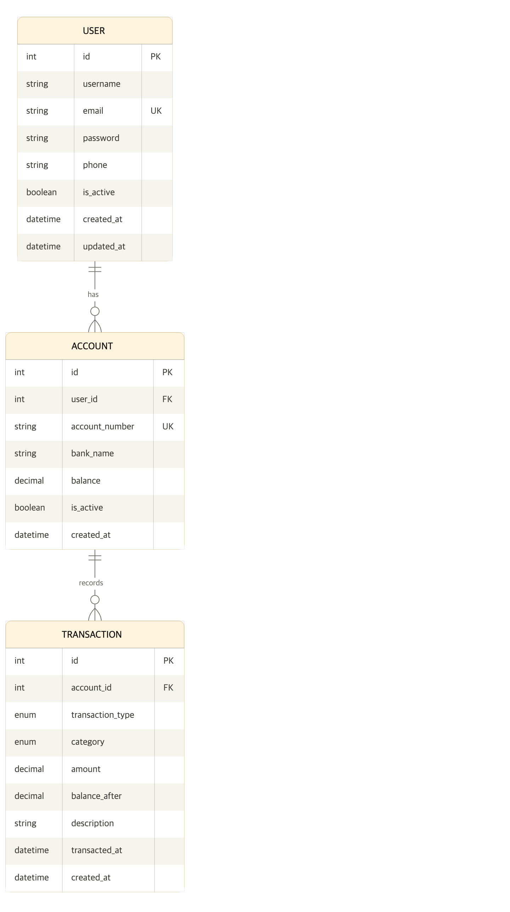

# Landing MVP 사용자 스토리

---

## 1. 협업 및 개발 환경
**Story:**  
팀원 모두가 동일한 환경에서 충돌 없이 개발하고, 검증된 코드만 배포 프로세스에 포함한다.

**Acceptance Criteria**
- Docker Compose 실행만으로 로컬 개발 환경 셋업 완료
- main 브랜치 보호(Direct Push 차단), 최소 1인 이상 승인 후 Merge
- 모든 커밋은 팀 내 약속된 컨벤션을 준수하며 PR 기반 코드 리뷰
- 신규 팀원이 README.md 가이드만으로 30분 내 로컬 실행 성공

---

## 2. 도메인 모델링 및 설계
**Story:**  
역할(Role)에 따른 권한과 데이터 관계를 명확히 정의하여 API 구현의 일관성을 확보한다.

**Acceptance Criteria**
- ERD와 Django 모델 클래스 1:1 매칭, README 최신화
- 사용자 권한(Guest, User, Admin)별 접근 범위 명확히 정의
- 은행 코드, 거래 유형 등은 Enum/상수로 관리하여 매직 넘버 배제
- 마이그레이션 파일 관리 전략 및 모델 변경 이력 추적 가능

---

## 3. 인증 및 계정 관리
**Story:**  
사용자가 본인 계정을 안전하게 생성, 유지, 종료할 수 있는 보안 환경을 구축한다.

**Acceptance Criteria**
- JWT 기반 인증 시스템(Access/Refresh Token) 구현
- 로그아웃 시 토큰 즉시 무효화(Blacklist 등)
- 회원가입/정보 수정 시 입력값 유효성 검증 적용
- 본인 외 계정 정보 수정/삭제 시 403 Forbidden 반환

---

## 4. 계좌 관리
**Story:**  
사용자가 자신의 자산 저장소(계좌)를 생성 및 관리한다.

**Acceptance Criteria**
- 계좌 생성 시 요청자(User)가 소유자로 자동 할당
- 계좌 목록 조회 시 '본인 계좌'만 필터링 반환
- 논리 삭제(Soft Delete) 또는 상태 값(Active/Inactive) 관리
- 타인 계좌 번호로의 무단 접근/삭제 시도 차단

---

## 5. 거래 내역(입출금) 관리
**Story:**  
모든 현금 흐름을 기록하고, 필터를 통해 필요한 내역을 신속하게 조회한다.

**Acceptance Criteria**
- 입금/출금 시 잔액 계산 로직 정합성 보장
- 기간(Start/End Date), 카테고리별 필터링 기능 제공
- 거래 데이터는 생성 후 임의 수정/삭제 불가(Immutable) 또는 변경 이력 보존
- 대량 조회 시 페이지네이션(Pagination) 적용

---

## 6. 시스템 운영 및 문서화
**Story:**  
운영자는 데이터를 관리하고, 개발자는 API 스펙을 즉시 확인할 수 있다.

**Acceptance Criteria**
- Django Admin으로 전체 도메인 모델(User, Account, Transaction 등) 관리
- Swagger(drf-spectacular)로 API 자동 문서화 및 테스트 제공
- 핵심 비즈니스 로직(Unit Test) 커버리지 확보
- N+1 쿼리 발생 여부 점검 및 select_related/prefetch_related 최적화

---

## 7. 배포 인프라
**Story:**  
클라우드 환경에 서비스를 배포, 외부 접근 가능한 스테이징 환경을 구축한다.

**Acceptance Criteria**
- AWS EC2 등 클라우드 환경에 Docker 컨테이너 기반 배포 완료
- API 서버 상태 확인용 헬스체크(Health-check) 엔드포인트 제공
- 환경변수(.env)로 설정 분리(Dev/Prod) 및 보안 관리
- 배포 프로세스 및 서버 접속 방법 포함 가이드 문서 제공

---

---

## ERD

---

## 테이블 설명

### USER
사용자 계정 정보를 저장하는 테이블입니다.

| 필드 | 타입 | 설명 |
|---|---|---|
| id | INT | PK |
| username | VARCHAR | 사용자 이름 |
| email | VARCHAR | 이메일 (로그인 ID, Unique) |
| password | VARCHAR | 비밀번호 |
| phone | VARCHAR | 전화번호 |
| is_active | BOOLEAN | 활성화 여부 |
| created_at | DATETIME | 생성일시 |
| updated_at | DATETIME | 수정일시 |

### ACCOUNT
사용자가 보유한 계좌 정보를 저장하는 테이블입니다.

| 필드 | 타입 | 설명 |
|---|---|---|
| id | INT | PK |
| user_id | INT | FK (USER) |
| account_number | VARCHAR | 계좌번호 (Unique) |
| bank_name | VARCHAR | 은행명 |
| balance | DECIMAL | 잔액 |
| is_active | BOOLEAN | 활성화 여부 |
| created_at | DATETIME | 생성일시 |

### TRANSACTION
계좌별 거래 내역을 저장하는 테이블입니다.

| 필드 | 타입 | 설명 |
|---|---|---|
| id | INT | PK |
| account_id | INT | FK (ACCOUNT) |
| transaction_type | ENUM | 거래 유형 (입금/출금) |
| category | ENUM | 카테고리 (식비/교통비/고정비용/저축/생활비/문화생활/기타) |
| amount | DECIMAL | 거래 금액 |
| balance_after | DECIMAL | 거래 후 잔액 |
| description | VARCHAR | 거래 설명 |
| transacted_at | DATETIME | 거래 일시 |
| created_at | DATETIME | 생성일시 |

---

## 테이블 관계

| 관계 | 설명 |
|---|---|
| USER : ACCOUNT | 1:N — 한 사용자는 여러 계좌를 보유할 수 있다. |
| ACCOUNT : TRANSACTION | 1:N — 한 계좌에는 여러 거래 내역이 기록된다. |
